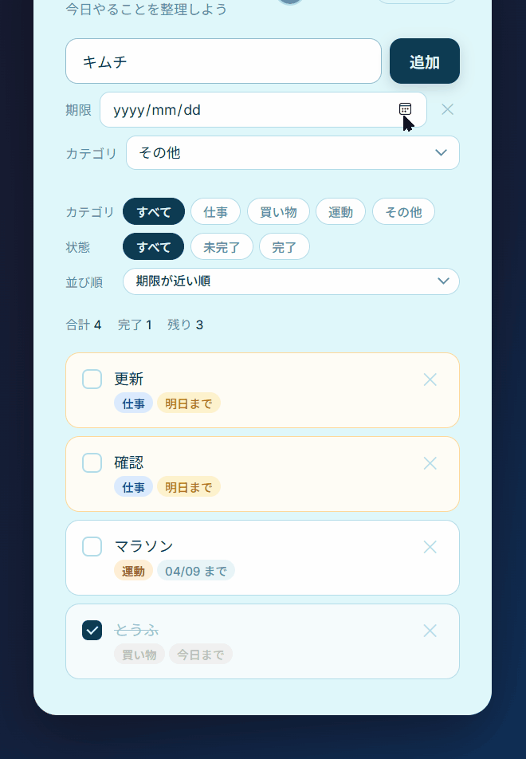

# 📝 My ToDo App

Firebaseを使用したシンプルなToDoアプリです。  
ログインユーザーごとにタスクを管理し、リアルタイム同期・オフライン対応を実装しています。

---

## 🚀 デモ



---

## ✨ 主な機能

- ✅ タスクの追加・編集・削除
- ✅ ステータス管理（未完了 / 完了）
- ✅ カテゴリ分類（仕事 / 買い物 / 運動 / その他）
- ✅ 期限設定
- ✅ 並び替え（期限順など）
- ✅ リアルタイム同期（Firestore）
- ✅ オフライン対応（Persistence）
- ✅ 認証機能（Firebase Authentication）
- ✅ エラーハンドリング
- ✅ 成功・失敗トースト表示

---

## 🛠 使用技術

- HTML / CSS / JavaScript
- Firebase Authentication
- Cloud Firestore
- Firebase Hosting
- Service Worker（PWA対応）

---

## 🔐 セキュリティ（Firestoreルール）

ログインユーザー本人のみデータの読み書きが可能です。

```js
match /users/{userId} {
  allow read, write: if request.auth != null && request.auth.uid == userId;

  match /tasks/{taskId} {
    allow read, write: if request.auth != null && request.auth.uid == userId;
  }
}
⚙️ こだわりポイント
🔄 リアルタイム同期
onSnapshot を使用してデータ変更を即時反映
PC・スマホ間で即同期
📡 オフライン対応
enablePersistence() によりオフラインでも操作可能
再接続時に自動同期
⚡ 楽観的UI（Optimistic UI）
書き込み成功を待たず即UI反映
オフラインでも自然な操作感
⚠️ エラーハンドリング
ネットワークエラー表示
Firestore拒否時の通知
トーストでユーザーに即フィードバック
📱 動作環境
PC（Chrome / Edge）
スマートフォン（iOS / Android）
🔗 公開URL

https://3208man-art.github.io/todo-app/

📌 今後の改善案
ダークモード対応
通知機能（期限リマインド）
UIアニメーション強化
タグ機能
👤 作者

kousuke yagi
